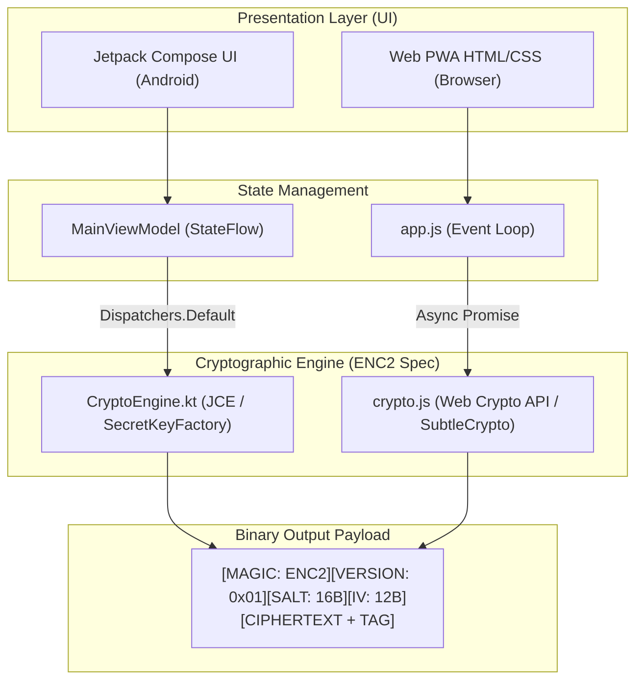

# Secure Encryptor - Architecture & Security Documentation

An in-depth technical overview of **Secure Encryptor**, a cross-platform client-side encryption utility implementing military-grade **AES-256-GCM** encryption and **PBKDF2-HMAC-SHA256** key derivation.

---

## 📐 System Architecture

Secure Encryptor is built with a decoupled architecture separating cryptographic primitives from the presentation layer. Both the **Native Android Application** (Kotlin + Jetpack Compose) and the **Web PWA** (HTML5 + Web Crypto API) share the exact same binary format (`ENC2`).



---

## 🔐 Cryptographic Specifications

Secure Encryptor uses authenticated symmetric encryption with key stretching:

| Component | Specification |
| :--- | :--- |
| **Symmetric Cipher** | `AES-256-GCM` (`AES/GCM/NoPadding`) |
| **Cipher Key Length** | 256 bits (32 bytes) |
| **Initialization Vector (IV)** | 96 bits (12 bytes), cryptographically random per operation |
| **Authentication Tag** | 128 bits (16 bytes) appended to ciphertext |
| **Key Derivation Function (KDF)** | `PBKDF2WithHmacSHA256` |
| **PBKDF2 Iterations** | `100,000` iterations |
| **Salt** | 128 bits (16 bytes), cryptographically random per operation |
| **Magic Header** | `0x45 0x4E 0x43 0x32` (`"ENC2"` in ASCII) |
| **Version Byte** | `0x01` |

---

## 📦 Binary Header Layout (`ENC2`)

All encrypted data produced by Secure Encryptor adheres to a strict binary format.

### 1. Encrypted Text Layout (Base64 Output)

```
+------------------+------------------+------------------+------------------+-----------------------+
|  MAGIC BYTES     |  VERSION BYTE    |  SALT BYTES      |  IV BYTES        |  CIPHERTEXT + TAG     |
|  "ENC2" (4B)     |  0x01 (1B)       |  Random (16B)    |  Random (12B)    |  Variable Length      |
+------------------+------------------+------------------+------------------+-----------------------+
```

### 2. Encrypted File Layout

```
+---------------+--------------+--------------+--------------+------------------+-------------------+--------------------+
|  MAGIC BYTES  | VERSION BYTE |  SALT BYTES  |   IV BYTES   | FILENAME LEN     | FILENAME BYTES    | CIPHERTEXT + TAG   |
|  "ENC2" (4B)  |  0x01 (1B)   | Random (16B) | Random (12B) | 2B (Big Endian)  | UTF-8 Encoded     | Variable Length    |
+---------------+--------------+--------------+--------------+------------------+-------------------+--------------------+
```

---

## 🔄 Cross-Platform Interoperability

Because Java Cryptography Extension (JCE) and the W3C Web Crypto API both output GCM ciphertexts with 128-bit authentication tags appended directly to the end of the ciphertext payload, data encrypted on Android can be seamlessly decrypted in the web browser, and vice versa.

### Verifying Interoperability

An automated test suite verifies cross-platform decryption compatibility:

```kotlin
// Android / JVM Decryption of Web Crypto API payload
val webPayload = "RU5DMgEOZO2r6DzP/Bvhw2eCAjXI3hx7tNFsXaJ86QBd6EnOCddJemka..."
val password = "SharedSecretPassword2025!"

val decrypted = CryptoEngine.decryptText(password, webPayload)
assert(decrypted == "Interoperability Test Message from Web Crypto!")
```

---

## 🎨 Android App Architecture & Tech Stack

The Android application is written in modern **Kotlin** following Android Best Practices:

- **Jetpack Compose & Material 3**: Declarative UI components with custom Theme tokens.
- **Coroutines & Flow**: Asynchronous non-blocking crypto execution on `Dispatchers.Default` and file IO on `Dispatchers.IO`.
- **Edge-to-Edge**: Native support for Android 15 (SDK 35) insets using `enableEdgeToEdge()`.
- **Animated Transitions**: Smooth state transitions between Text Input Mode and Result Mode using Compose `AnimatedContent`.

---

## 🧪 Testing & Quality Assurance

The project includes both automated unit tests and runtime validation:

- **JUnit Unit Tests**: [`CryptoEngineTest.kt`](../app/src/test/java/com/secureencryptor/app/crypto/CryptoEngineTest.kt) testing roundtrips, invalid passwords, corrupted data, and strength estimation.
- **Interoperability Script**: Cross-language script verifying Web JS -> Kotlin decryption.
- **Static Analysis**: Zero compilation warnings or lint errors.
